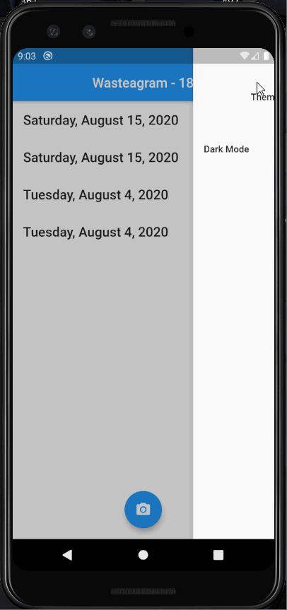

# *Wasteagram*

**Wasteagram** is a mobile app created with Dart/Flutter that utilizes Firebase and Firestore to allow the creation of food waste posts, including an image, number of items, date and location.  The user can toggle between light and dark mode in the settings.

## Video Walkthrough

Here's a walkthrough:

GIF created with [LiceCap](http://www.cockos.com/licecap/).
